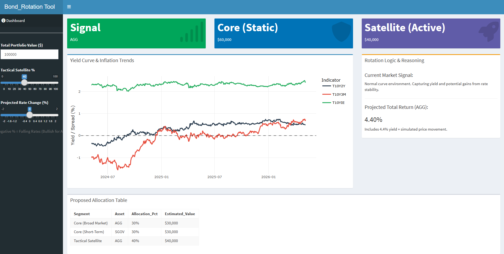

## Live Application
**Access the tool here:** [https://jklmdata.shinyapps.io/bond_rotation/](https://jklmdata.shinyapps.io/bond_rotation/)

---

## 1. Overview
The **Bond_Rotation** tool is a quantitative decision-support system designed for rotating assets within tax-deferred retirement accounts (such as Fidelity BrokerageLink or TSP). By analyzing real-time Treasury yield curve dynamics and inflation breakevens, the app provides data-driven signals to optimize the balance between yield capture and capital preservation.

This project implements a **Core-Satellite Tactical Asset Allocation (TAA)** strategy, specifically designed to navigate environments of fluctuating interest rates and inflation expectations.

## 2. The Core-Satellite Strategy
To mitigate "whipsaw" risk and ensure baseline stability, the tool assumes a portfolio split:
* **The Core (60%):** A static "Steady-State" mix (e.g., 30% FXNAX/AGG and 30% FID GOVT MMKT/SGOV) that provides broad market exposure and liquidity.
* **The Satellite (40%):** The "Active Rotation Zone." This portion is tactically moved between assets based on macro-economic signals generated by the app.

## 3. Key Indicators & Logic
The dashboard monitors three primary signals sourced via the `tidyquant` API from the St. Louis Fed (FRED):

| Indicator | Metric | Logic |
| :--- | :--- | :--- |
| **10Y-2Y Spread** | Yield Curve Shape | If negative (Inverted), the signal shifts to **Cash (Money Market)** to capture high short-term yields without duration risk. |
| **10Y-3M Spread** | Recession Warning | Used as a secondary confirmation of inversion and economic contraction risk. |
| **10Y Breakeven** | Inflation Expectations | If > 2.5%, the signal recommends **FIPDX (TIPS)** to hedge against purchasing power loss. |

## 4. Features
* **Dynamic Signal Box:** Real-time recommendation (Green = Aggregates, Red = Cash/Money Market, Yellow = TIPS).
* **Sensitivity Stress Test:** A "Projected Rate Change" slider that uses **Bond Duration** math ($Total Return \\approx Yield + (Duration \\times \\Delta Yield \\times -1)$) to model how potential rate moves impact total returns.
* **BrokerageLink Optimization:** Recommends specific institutional funds like **FXNAX** and **FID GOVT MMKT** for seamless execution.
* **Interactive Visuals:** Built with `plotly` to track the 2-year history of yield spreads.

## 5. Technical Architecture
* **Language:** R
* **Framework:** `shiny`, `shinydashboard`
* **Data Science Stack:** `tidyverse` (Data manipulation), `tidyquant` (Financial API), `plotly` (Interactive graphing).
* **Environment Management:** `renv` integration for 100% reproducibility across different local and server environments.
* **Deployment:** Hosted via Shinyapps.io.

## 6. How to Use
1.  **Check Monthly:** Ideally after CPI or Non-Farm Payroll releases.
2.  **Observe the Signal:** If the "Signal" box changes color, evaluate a rotation of the **Satellite** portion of your portfolio.
3.  **Stress Test:** Use the slider to determine if the "Reward" of holding bonds (FXNAX/AGG) outweighs the "Risk" of potential further rate hikes.

## 7. References & Academic Foundation
This tool is built upon the **Core-Satellite Tactical Asset Allocation (TAA)** framework. This methodology seeks to minimize tracking error through a "Core" of passive index funds while capturing "Alpha" through tactical tilts in the "Satellite" portion.

### Industry White Papers & Frameworks
* **Vanguard Investment Strategy Group.** _Core-Satellite Investing: A Strategy for Portfolio Construction._ This framework validates the use of low-cost index funds (like FXNAX) as the core to reduce expense ratios while utilizing active satellites for specific macro regimes.

* **CFA Institute.** _Strategic vs. Tactical Asset Allocation._ The CFA curriculum defines the "Macro-Filter" approach used in this tool, where the yield curve serves as the primary signal for shifting between duration-heavy and cash-equivalent assets.

### Macroeconomic Theory
* **Estrella, A., & Mishkin, F. S. (1996).**  _The Yield Curve as a Predictor of U.S. Recessions._ Federal Reserve Bank of New York. This research justifies the use of the **10Y-3M** and **10Y-2Y** spreads in the Bond_Rotation tool as reliable signals for economic regime shifts.

* **Fisher, I. (1930). The Theory of Interest.** Provides the "Fisher Equation" logic behind the **10-Year Breakeven Inflation** signal used to trigger rotations into FIPDX/TIPS.
---

### Reproducibility Note
This project follows a **Hybrid Archiving strategy**. To run this locally:
1. Clone the repository.
2. Open `Bond_Rotation.Rproj`.
3. Run `renv::restore()` to synchronize your local library with the project's lockfile.
"""
